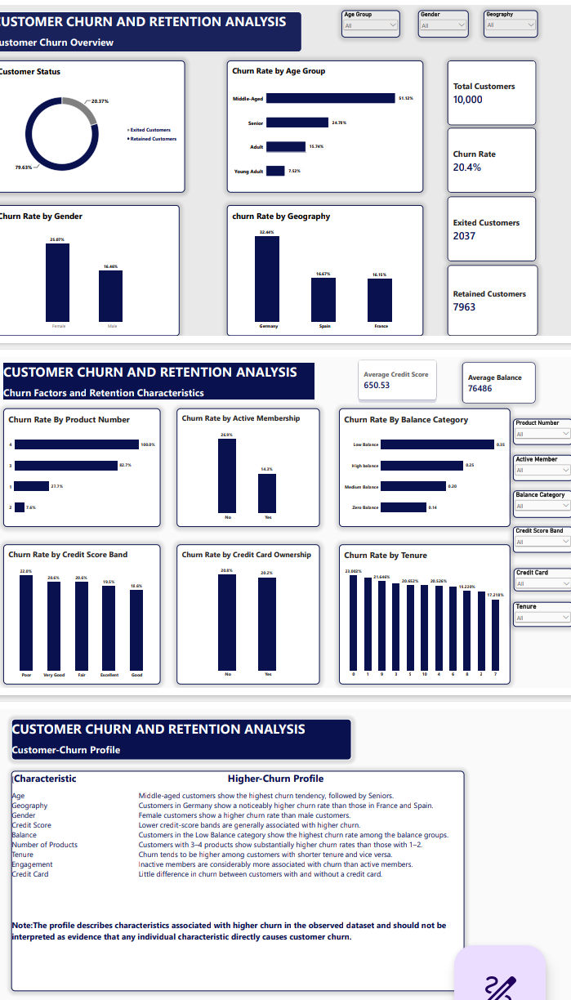

# Customer-Churn-and-Retention-Strategy-Analysis
This project explores customer churn patterns using historical customer data. The analysis focuses on customer characteristics, financial attributes, product ownership, engagement and geographical differences in churn.  The project was completed using Power Query, SQL, Power BI and DAX

## Project Overview
Customer retention is an important part of business growth and sustainability. Understanding why customers leave, which customer characteristics are associated with churn, and what retained customers have in common can help businesses develop more informed retention strategies.
This project explores customer churn patterns using historical customer data of a U.S bank published by Shantanu Dhakad on Kaggle. The analysis focuses on customer characteristics, financial attributes, product ownership, engagement and geographical differences in churn.
The project was completed using Power Query, SQL, Power BI and DAX.

## Business Problem
Customer churn can affect revenue, customer relationships and long-term business performance.
The purpose of this analysis is to examine customer churn patterns, identify customer characteristics associated with higher churn, explore retention-related behaviours and provide insights that may support customer retention efforts.

## Business Questions
The analysis seeks to answer the following questions:
1. What is the overall customer churn rate and how does it vary across the customer base?
2. What customer characteristics are associated with churning?
3. How are customer engagement and retention related?
4. What does a customer with a higher tendency to churn look like?
5. What retention strategies can be developed from the observed patterns?

## Project Objectives
1. To assess the overall customer churn rate and examine how churn varies across the customer base.
2. To identify customer characteristics associated with higher churn tendencies.
3. To examine the relationship between customer engagement and customer retention.
4. To develop a customer churn profile based on characteristics and behaviors associated with higher churn tendencies
5. To provide data-driven insights and retention strategies that can help improve customer retention.

## Dataset Description
The dataset contains 10,000 customer records and includes information about:
- Customer demographics
- Geography
- Gender
- Credit score
- Age
- Tenure
- Account balance
- Number of products
- Credit-card ownership
- Active membership
- Estimated salary
- Customer churn status

The original customer churn status was represented using binary values:
- "0" — Retained
- "1" — Exited
The status was transformed into more readable categories during data preparation.

## Tools Used
- Power Query — Data inspection, cleaning and transformation
- SQL Server Management Studio — Data exploration and analysis
- Power BI — Dashboard development and visualisation
- DAX — KPI and churn-rate calculations
- Excel — Exporting the cleaned dataset to CSV
- GitHub — Project documentation and version control

## Data Cleaning and Transformation
The dataset was inspected for:
- Duplicate records
- Missing values
- Inconsistent values
- Incorrect data types
- Unreadable category labels
The dataset appeared clean, with no major issues identified during inspection.

The following transformations were made:
- Converted customer status from "0/1" into Retained/Exited
- Converted credit-card ownership into Yes/No
- Converted active membership into Active/Inactive
- Created age groups
- Created credit-score bands
- Created balance categories
- Kept original numerical fields for further analysis

## Key Performance Indicators
The analysis produced the following overall customer churn figures:
Total Customers  -  10,000
Exited Customers    -  2,037
Retained Customers  -  7,963
Churn Rate          -  20.37%
Average Credit Score-  650.5
Average Balance      -  76,486
Average Estimated Salary- 100,090

## Key Findings
- Overall Churn:The overall customer churn rate was approximately 20.37%, meaning that about one in every five customers in the dataset had exited.
- Geography: Customers in Germany recorded the highest churn rate among the three countries represented in the dataset.
- Gender: Female customers showed a higher churn rate than male customers.
- Age: Churn was more strongly associated with the Middle-Aged customer group, followed by Seniors.
- Credit Score: Lower credit-score bands generally showed higher churn rates than stronger credit-score bands.
- Balance: Customers in the Low Balance category recorded the highest churn rate among the balance groups examined.
- Number of Products: Customers with three or four products showed substantially higher churn rates than customers with one or two products.The four-product category showed an especially high churn rate. However, the size of this customer group should be considered before making broad conclusions.
- Tenure: Churn tended to be higher among customers with shorter tenure and generally decreased as tenure increased.
- Active Membership: Inactive members were considerably more associated with churn than active members.This pattern was also observed across the different geographical groups.
- Credit-Card Ownership: Churn rates were very similar for customers with and without a credit card, approximately 20% and 21% respectively.This suggests that credit-card ownership was not a strong distinguishing characteristic of churn in this dataset.

## Higher-Churn Customer Profile
Based on the observed patterns, a customer with a higher tendency to churn may be associated with the following characteristics:
- Belongs to the Middle-Aged or Senior age group
- Is located in Germany
- Is female
- Falls within a lower credit-score band
- Has a low account balance
- Holds three or more products
- Has a shorter customer tenure
- Is an inactive member
These characteristics should not be interpreted as automatic indicators that a customer will churn. They describe patterns observed in the historical dataset and may help identify areas for further investigation.

## Retention Insights
The analysis suggests that customer engagement may be an important area for retention efforts.
In particular:
- Inactive members show higher churn rates than active members.
- Shorter-tenure customers may require stronger onboarding and engagement support.
- Customers in Germany may require closer investigation because of the higher churn rate observed in that region.
- Customers with multiple products may need further investigation to understand whether product complexity, service experience or other factors are associated with their churn.
- Lower credit-score and low-balance customer groups may benefit from more targeted customer support and engagement strategies.

## Recommendations
Based on the findings, the following strategies may be considered:
1. Strengthen customer engagement
   Develop targeted engagement campaigns for inactive members, including personalised communication, product education and relevant service reminders.
2. Improve early customer onboarding
    Provide stronger onboarding support for newer customers to help them understand available services and build lasting relationships with the business.
3. Investigate geographical differences
    Examine customer experience, service delivery, pricing, competition and other regional factors that may contribute to Germany’s higher churn rate.
4. Review multiple-product customers
   Investigate why customers with three or four products show higher churn. The business may need to review product suitability, customer understanding and service experience.
5. Use targeted retention monitoring
   Monitor customer groups associated with higher churn and develop appropriate interventions rather than applying the same strategy to every customer.
6. Continue monitoring churn patterns
    Use Power BI dashboards and regular reporting to track changes in churn rates and evaluate whether retention efforts are producing improvements.

## Dashboard Preview
- Page 1 — Customer Churn Overview
- Page 2 — Churn Factors and Retention Characteristics
- Page 3 — Higher-Churn Customer Profile
### dashboard images

## Project Files
The repository contains the following files:
- cleaned and transformed data used for the analysis.
- sql queries used during analysis.
- power bi dashboard and analysis file.
- dashboard pdf image and project visuals.

## Limitations
This analysis is based on historical observational data.
The findings identify patterns and associations within the dataset. They do not establish that any individual characteristic directly causes customer churn.
The analysis also does not predict which individual customers will churn in the future.

## Future Improvements
A possible next step is to develop a predictive churn model using Data Science and machine learning techniques.
Future work may include:
- Feature engineering
- Exploratory statistical testing
- Predictive modelling
- Model evaluation
- Customer churn probability scoring
- Retention campaign targeting
- Monitoring model performance over time

## Conclusion
This project provided an opportunity to examine customer churn from the data-cleaning stage through SQL analysis and Power BI dashboard development.
It also highlighted the importance of distinguishing between descriptive findings, associations and causal explanations when interpreting data.
The analysis shows that customer churn is not explained by one variable alone. Different demographic, financial, product and engagement characteristics may occur together and should be considered when developing retention strategies.

## Author
**Grace Olunumelu**

